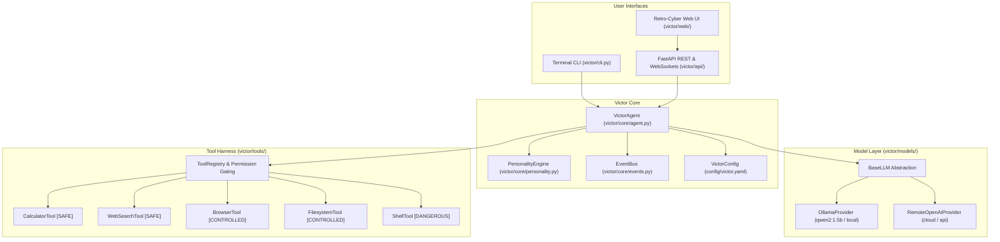
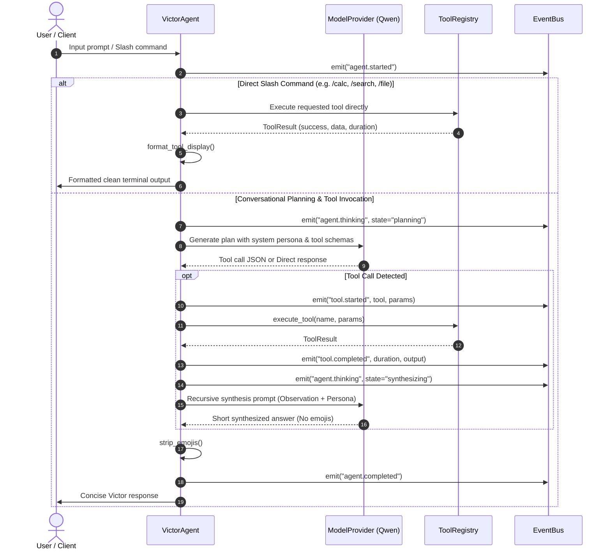
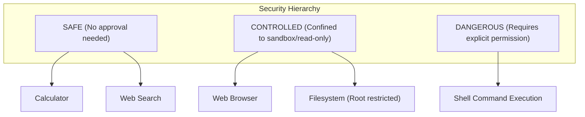

# VICTOR // THE ARTIFICIAL SOUL

> *"A small artificial mind with a world of tools."*

Victor is a **local-first, modular AI agent harness** engineered to feel like a small, curious artificial entity living inside the user's workstation. 

Victor operates with a decoupled cognitive architecture: the reasoning model serves as the decision layer, while the harness provides real-world capabilities through standardized tools, short- and long-term memory, real-time observability, and an independent personality engine.

---

## Table of Contents

1. [Product Vision & Philosophy](#1-product-vision--philosophy)
2. [Design Principles](#2-design-principles)
3. [System Architecture](#3-system-architecture)
4. [Execution Flow & ReAct Loop](#4-execution-flow--react-loop)
5. [Progressive Version Roadmap](#5-progressive-version-roadmap)
6. [Core Features in v0.1](#6-core-features-in-v01)
7. [Standardized Tool Harness](#7-standardized-tool-harness)
8. [Security & Permission Tiers](#8-security--permission-tiers)
9. [Installation & Setup](#9-installation--setup)
10. [Usage Guide](#10-usage-guide)
    - [Retro-Cyber Web Command Center](#retro-cyber-web-command-center)
    - [Terminal Interactive CLI](#terminal-interactive-cli)
    - [Slash Commands Reference](#slash-commands-reference)
11. [Configuration Reference](#11-configuration-reference)
12. [Testing & Verification](#12-testing--verification)
13. [Project Directory Layout](#13-project-directory-layout)
14. [Contributing & License](#14-contributing--license)

---

## 1. Product Vision & Philosophy

Victor is designed around character and utility rather than pure API chaining:
- **Character Independent of Model**: Changing the underlying LLM does not destroy Victor's personality, curiosity, or memory.
- **Hands and Ears**: An artificial mind is only as useful as its interaction with the environment. Victor couples language models with a safe, extensible tool harness.
- **Observable by Default**: Every thought step, tool invocation, duration, and output is visible in real-time through event subscriptions.

---

## 2. Design Principles

- **Local First**: Prioritizes local inference (via Ollama / llama.cpp), local memory, and local filesystem access.
- **Modular**: Model providers, tools, memory stores, and interfaces are isolated components adhering to strict contracts.
- **Extensible**: Adding a new capability requires creating a tool class and registering it, without modifying the agent core.
- **Model Agnostic**: Compatible with local small models (Qwen 1.5B/2B/3B) and remote endpoints (OpenAI, Groq, OpenRouter).
- **Safe by Default**: Risky actions (such as shell execution or external file mutation) require explicit permission.
- **No Fluff / Zero Emojis**: Clean, technical, retro-cyber terminal presentation with concise, recursively synthesized responses.

---

## 3. System Architecture



---

## 4. Execution Flow & ReAct Loop



---

## 5. Progressive Version Roadmap

The development of Victor progresses from simple harness foundations to multi-modal autonomy:

| Version | Title | Core Focus | Status |
| :--- | :--- | :--- | :--- |
| **v0.1** | **The Harness & Brain** | Modular tool harness, Ollama/Remote LLM layer, safe tool suite, independent personality engine, interactive CLI, retro-cyber amber Web UI. | **Completed** |
| **v0.2** | **The Live Nervous System** | Full event bus with WebSocket pub/sub, real-time live DAG execution graph (React Flow), node status animations, and input/output inspectors. | *Up Next* |
| **v0.3** | **The Memory & Recall** | SQLite episodic conversation persistence, user-curated long-term memory, semantic embeddings / vector RAG, `/remember` & `/forget` commands. | *Planned* |
| **v0.4** | **The Voice (Ears & Speech)** | Local Whisper STT (push-to-talk & continuous listening), local Piper/Kokoro TTS, emotional voice modulation, audio waveforms. | *Planned* |
| **v0.5** | **Autonomous Mind & Safety** | Autonomous multi-step planning, tool chaining, self-correction, dynamic model switcher, and interactive permission confirmation modals. | *Planned* |

---

## 6. Core Features in v0.1

- **Standardized Tool Harness**: Universal `BaseTool` contract with JSON schema parameter validation, execution timing, and structured outputs.
- **Multi-Provider Model Layer**: Pluggable `BaseLLM` interface supporting native `OllamaProvider` (auto-detects Qwen models with RAM diagnostics) and `RemoteOpenAIProvider`.
- **Zero-Emoji Retro-Cyber Terminal UI**:
  - Pure terminal black (`#060608`) with amber/orange phosphor accents (`#ff8800`).
  - No gradients; razor-sharp 1px borders and subtle CRT glow.
  - All emojis stripped at the core and replaced with technical brackets (`[SYS.01]`, `[ONLINE]`, `[TOOLS]`, `[EXEC ⏎]`).
- **Concise Recursive Tool Synthesis**:
  - Mathematical evaluation: `> CALC: 144 * 12 = 1728`
  - Web search indexing: `> SEARCH // "query" (3 hits)` with clean URL previews.
  - Safe file inspector: `> FILE // config/victor.yaml (28 lines)`
  - ReAct observation synthesis: short, punchy 1-to-3 sentence answers without raw JSON dumps.
- **Dual Interface Delivery**:
  - **FastAPI Web Server** with real-time WebSockets on port `8000`.
  - **Interactive Terminal CLI** with colored REPL and command completion.

---

## 7. Standardized Tool Harness

Every tool implements the standard contract:

```python
class BaseTool(ABC):
    name: str
    description: str
    parameters: Dict[str, Any]  # JSON Schema
    permission: PermissionLevel  # SAFE | CONTROLLED | DANGEROUS
    slash_command: Optional[str]
    
    async def run(self, **kwargs) -> Any: ...
    async def execute(self, **kwargs) -> ToolResult: ...
```

### Initial Tool Suite

| Tool | Slash Command | Permission | Description |
| :--- | :--- | :--- | :--- |
| **`calculator`** | `/calc <expr>` | `SAFE` | Safe AST-based math evaluation (`sqrt`, `sin`, `cos`, arithmetic) with exponential protection. |
| **`web_search`** | `/search <query>` | `SAFE` | Queries live DuckDuckGo index and parses structured titles, clean URLs, and snippets. |
| **`browser`** | `/browse <url>` | `CONTROLLED` | Fetches webpage and extracts readable article text, removing boilerplate scripts and tags. |
| **`filesystem`** | `/file <path>` | `CONTROLLED` | Reads local workspace files with strict directory boundary containment. |
| **`shell`** | `/shell <cmd>` | `DANGEROUS` | Executes local shell commands with timeout; requires explicit authorization in config. |

---

## 8. Security & Permission Tiers



- **`SAFE`**: Deterministic computations and read-only search operations.
- **`CONTROLLED`**: External web fetching and filesystem reading within permitted root paths (`allowed_file_roots`).
- **`DANGEROUS`**: Arbitrary shell execution. Disabled by default (`allow_shell: false`). Attempted invocations return permission denial unless explicitly configured.

---

## 9. Installation & Setup

### Prerequisites
- Python 3.10+ (tested on Python 3.14)
- Git
- *(Optional for local models)*: [Ollama](https://ollama.com/) with `qwen2:1.5b` or `qwen3.5:2b`

### Setup Steps

```bash
# Clone the repository
git clone https://github.com/your-username/Victor_The_Artificial_Soul.git
cd Victor_The_Artificial_Soul

# Install dependencies
pip install -r requirements.txt
```

---

## 10. Usage Guide

### Retro-Cyber Web Command Center

Start the server:

```bash
python -m victor.api.server
```

Open your browser at: **`http://localhost:8000`**

- View live status, active model, and installed capabilities.
- Execute direct commands or chat naturally with Victor.
- Inspect live tool execution traces with duration timers and outputs.

### Terminal Interactive CLI

Launch the terminal REPL:

```bash
python -m victor.cli
```

### Slash Commands Reference

| Command | Syntax | Example |
| :--- | :--- | :--- |
| **Help** | `/help` | Display command index |
| **Tools** | `/tools` | List registered capabilities & permission tiers |
| **Clear** | `/clear` | Wipe current conversation history |
| **Info** | `/info` | Display active node profile, core model, and settings |
| **Calculate** | `/calc <expression>` | `/calc sqrt(256) * 10 + 4` |
| **Search** | `/search <query>` | `/search latest compiler optimization advances` |
| **Browse** | `/browse <url>` | `/browse https://en.wikipedia.org/wiki/Compiler` |
| **Read File** | `/file <path>` | `/file config/victor.yaml` |
| **Shell** | `/shell <command>` | `/shell dir` *(if authorized)* |

---

## 11. Configuration Reference

Victor is configured via [`config/victor.yaml`](config/victor.yaml):

```yaml
name: "Victor"
title: "The Artificial Soul"
tagline: "A small artificial mind with a world of tools."

personality:
  curiosity: "high"
  humor: "low"
  formality: "medium"
  enthusiasm: "low"
  tone: "Sharp, calm, retro-cyber terminal intelligence. Concise, technical, observant, no emojis."

behavior:
  concise: true
  explain_tools: true
  acknowledge_errors: true
  no_emojis: true
  max_response_sentences: 3

model:
  provider: "ollama"           # "ollama" or "remote" / "openai"
  name: "qwen2:1.5b"
  fallback_model: "qwen3.5:2b"
  api_base: "http://127.0.0.1:11434"
  temperature: 0.5
  max_tokens: 512

security:
  allow_shell: false           # Set true to authorize /shell execution
  allowed_file_roots:
    - "."
```

---

## 12. Testing & Verification

The project includes unit and integration tests covering tools, AST parsing, safety limits, slash commands, and API endpoints.

Run the test suite:

```bash
python -m pytest -v tests/
```

Expected output:
```text
tests/test_agent.py::test_personality_prompt_generation PASSED
tests/test_agent.py::test_agent_direct_slash_command PASSED
tests/test_agent.py::test_agent_tools_listing_command PASSED
tests/test_agent.py::test_agent_extract_tool_call PASSED
tests/test_api.py::test_root_endpoint PASSED
tests/test_api.py::test_api_status PASSED
tests/test_api.py::test_api_tools PASSED
tests/test_api.py::test_api_chat_slash_calc PASSED
tests/test_tools.py::test_calculator_basic PASSED
tests/test_tools.py::test_calculator_functions PASSED
tests/test_tools.py::test_calculator_power_protection PASSED
tests/test_tools.py::test_tool_registry_permissions PASSED
tests/test_tools.py::test_filesystem_tool_boundary PASSED
======================== 13 passed in 2.5s ========================
```

---

## 13. Project Directory Layout

```text
Victor_The_Artificial_Soul/
├── config/
│   └── victor.yaml              # Persona, model, and security configuration
├── tests/
│   ├── test_agent.py            # Agent loop and prompt tests
│   ├── test_api.py              # FastAPI endpoint integration tests
│   └── test_tools.py            # Calculator, filesystem, registry tests
├── victor/
│   ├── api/
│   │   ├── __init__.py
│   │   └── server.py            # FastAPI REST & WebSocket server
│   ├── core/
│   │   ├── __init__.py
│   │   ├── agent.py             # Main Victor agent loop & command router
│   │   ├── config.py            # YAML configuration loader
│   │   ├── events.py            # Asynchronous EventBus
│   │   └── personality.py       # Decoupled persona prompt builder
│   ├── models/
│   │   ├── __init__.py
│   │   ├── base.py              # BaseLLM abstraction
│   │   ├── factory.py           # Model provider factory
│   │   ├── ollama.py            # Local Ollama provider with diagnostics
│   │   └── remote.py            # Remote OpenAI-compatible provider
│   ├── tools/
│   │   ├── __init__.py
│   │   ├── base.py              # BaseTool contract and PermissionLevel
│   │   ├── browser.py           # Webpage fetcher & text extractor
│   │   ├── calculator.py        # AST safe math evaluator
│   │   ├── factory.py           # Standard tool registry factory
│   │   ├── filesystem.py        # Safe local file reader
│   │   ├── registry.py          # Central tool registry
│   │   ├── shell.py             # Permission-gated shell tool
│   │   └── web_search.py        # Live DuckDuckGo search tool
│   ├── web/
│   │   ├── app.js               # WebSocket client & retro UI logic
│   │   ├── index.html           # Retro-cyber terminal HTML
│   │   └── style.css            # Phosphor amber monospace stylesheet
│   └── cli.py                   # Terminal interactive REPL
├── .gitignore                   # Production gitignore
├── README.md                    # Comprehensive documentation
└── requirements.txt             # Project dependencies
```

---

## 14. Contributing & License

Contributions are welcome! Please open an issue or submit a pull request for additional tools or model providers.

Distributed under the **MIT License**.
