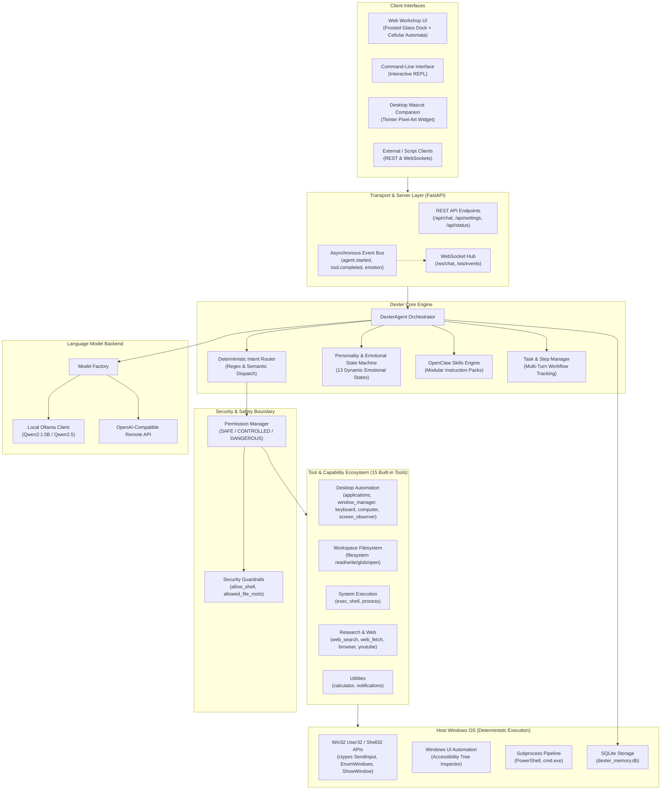
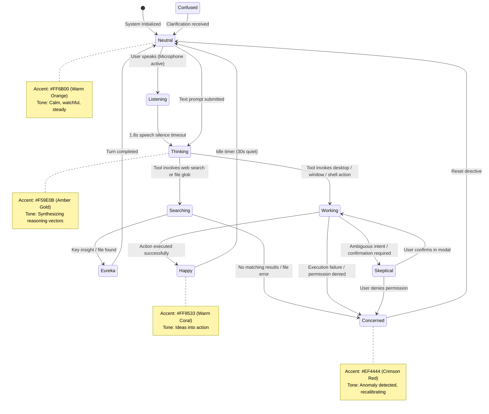
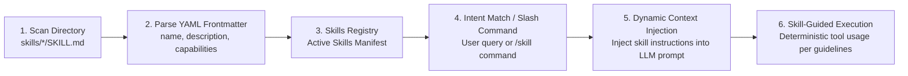

# Dexter — The Artificial Soul

Desktop AI companion and local PC control agent harness powered by small local language models.

Dexter operates as a quiet, typography-first assistant on your desktop. Running on local language models (such as Qwen2:1.5B via Ollama or OpenAI-compatible endpoints), Dexter operates offline with zero telemetry or data leakage. Dexter does not hallucinate actions: every command executes actual system tools, inspects outputs, and truthfully reports results.

---

## Table of Contents

- [Overview](#overview)
- [Key Features](#key-features)
- [System Architecture](#system-architecture)
- [Processing Pipeline & Execution Flow](#processing-pipeline--execution-flow)
- [Repository Structure](#repository-structure)
- [Prerequisites](#prerequisites)
- [Installation](#installation)
- [Running Dexter](#running-dexter)
- [Tools Reference](#tools-reference)
  - [Multi-Stage Binary Resolution Logic](#multi-stage-binary-resolution-logic)
  - [Screen Understanding & UI Automation Logic](#screen-understanding--ui-automation-logic)
- [Security & Permission Boundary](#security--permission-boundary)
- [Living Emotional State Machine](#living-emotional-state-machine)
- [Slash Commands](#slash-commands)
- [Skills System (OpenClaw Standard)](#skills-system-openclaw-standard)
- [Configuration Guide (`config/dexter.yaml`)](#configuration-guide-configdexteryaml)
- [API & WebSocket Protocol](#api--websocket-protocol)
- [Standalone Compilation & Installer](#standalone-compilation--installer)
- [Test Suite](#test-suite)
- [License](#license)

---

## Overview

Dexter bridges conversational AI with deterministic operating system control. Traditional assistants often struggle on smaller parameter weights (1.5B to 3B parameters) by hallucinating tool execution or getting trapped in reasoning loops. Dexter solves this via:

1. **Deterministic Intent Routing**: Regex and semantic pattern matching route user requests directly to registered tools without roundtrip token latency.
2. **Truth-Driven Action Execution**: Actions are performed via native Win32 APIs, ctypes, and system bindings. If an action fails, the system reports the exact error instead of faking success.
3. **Multi-Stage Binary Resolution**: Resolves application binaries across standard Windows program directories, Windows Registry `App Paths`, and Start Menu `.lnk` shortcuts. Applications launch cleanly in the foreground without flickering terminal consoles.
4. **Living Emotional State Machine**: Subtle emotional states (neutral, thinking, searching, happy, concerned, curious, eureka, skeptical, bored) dynamically guide personality, tone, and interface accent colors.
5. **Subtle Generative UI**: Conway B3/S23 Cellular Automata background canvas that responds gently to emotional tints without distracting animations.

---

## Key Features

- **PC Automation & Window Control**:
  - Launch applications (VS Code, Chrome, Edge, Notepad, Calculator, Terminal, Spotify, etc.) directly into the foreground.
  - Manage application windows: list open windows, bring to focus, minimize, maximize, restore, or close via Win32 messages.
  - Simulate natural keyboard input: character typing with Unicode support, key presses (Enter, Tab, Escape, F-keys), and hotkeys (`ctrl+c`, `alt+tab`, `win+d`).
  - Screen understanding via Windows UI Automation accessibility tree walking without computer vision overhead.
  - Mouse interaction: coordinate clicking, accessibility element clicking, double-clicking, right-clicking, and scrolling.

- **Workspace & Filesystem Management**:
  - Read file contents with safety boundary enforcement.
  - Search files using glob patterns across Desktop, Downloads, Documents, Pictures, Videos, and Music.
  - Open files or folders in default operating system handlers.
  - Create folders, create files, perform find-and-replace text edits, append content, rename, move, and copy files.

- **Runtime Execution & Process Inspection**:
  - Execute arbitrary shell and PowerShell commands (`exec` tool) with timeout controls and stdout/stderr capture.
  - List running processes, find processes by name, query status, and terminate tasks (`process` tool).

- **Web Research & Information**:
  - Real-time web search via DuckDuckGo without API keys.
  - Read and extract clean markdown text from web URLs (`web_fetch`).
  - Search and link YouTube videos.

- **Persistent Memory & Task Tracking**:
  - Long-term memory store backed by SQLite (`data/dexter_memory.db`). Automatically persists facts and user preferences.
  - Multi-step task tracking with status monitoring and duration accounting.

- **Companion Interfaces**:
  - Web interface with collapsible sidebar, typography-first message turns, and Cellular Automata background.
  - Desktop mascot widget built in Tkinter featuring animated pixel-art character states.
  - Interactive command-line interface (CLI) for headless or terminal-native operation.

---

## System Architecture

Dexter separates high-level language cognition from low-level operating system execution. The host environment, tool ecosystem, permission guardrails, and model engines communicate through an event-driven orchestrator:



---

## Processing Pipeline & Execution Flow

Every user prompt traverses a 4-phase deterministic pipeline designed to eliminate hallucinations on small models (1.5B–3B):

```mermaid
sequenceDiagram
    autonumber
    actor User as User
    participant Client as Web / Desktop Client
    participant Server as FastAPI / WebSocket Server
    participant Agent as DexterAgent Orchestrator
    participant Router as Intent Router
    participant Security as Permission Manager
    participant Tool as Target Tool (Win32 / OS)
    participant LLM as Local LLM (Ollama 1.5B)

    User->>Client: "Open Chrome and search for documentation"
    Client->>Server: POST /api/chat or WS send(message)
    Server->>Agent: process_message(user_input)
    Agent->>Agent: Transition state -> 'thinking'
    Agent-->>Server: Emit event 'agent.started'
    Server-->>Client: Real-time event (Render "Thinking... █")

    rect rgb(28, 32, 42)
        Note over Agent,Router: Phase 1: Fast Intent Routing (Zero LLM Latency)
        Agent->>Router: match_intent("Open Chrome and search...")
        Router-->>Agent: Action identified: applications.open_app(name="chrome", url="...")
    end

    rect rgb(38, 28, 24)
        Note over Agent,Security: Phase 2: Security & Permission Check
        Agent->>Security: check_permission("applications.open_app", params)
        Security-->>Agent: Allowed (SAFE / Verified Policy)
    end

    rect rgb(24, 36, 30)
        Note over Agent,Tool: Phase 3: Deterministic Tool Execution
        Agent->>Tool: execute(name="chrome", query="documentation")
        Tool->>Tool: Win32 5-Tier Binary Resolution & os.startfile()
        Tool-->>Agent: ToolResult(success=True, output="Launched Google Chrome...")
        Agent-->>Server: Emit event 'tool.completed'
    end

    rect rgb(36, 28, 44)
        Note over Agent,LLM: Phase 4: Truth-Grounded Response Synthesis
        Agent->>LLM: generate(system_prompt, tool_result, emotional_tone)
        LLM-->>Agent: "Done. I opened Google Chrome with your search."
    end

    Agent->>Agent: Update emotion -> 'happy' / 'eureka'
    Agent-->>Server: Response payload (content, emotion, tool_metrics)
    Server-->>Client: Message Turn + Dynamic Theme Update
    Client->>User: Display centered response + Blinking cursor block (█)
```



---

## Repository Structure

```
Dexter_The_Artificial_Soul/
├── config/
│   └── dexter.yaml             # Primary agent and security configuration
├── data/
│   └── dexter_memory.db        # SQLite database for persistent memory
├── dexter/
│   ├── api/
│   │   ├── __init__.py
│   │   └── server.py           # FastAPI REST endpoints and WebSocket server
│   ├── core/
│   │   ├── __init__.py
│   │   ├── agent.py            # DexterAgent orchestrator and processing loop
│   │   ├── config.py           # Configuration schema and loader
│   │   ├── events.py           # Asynchronous pub/sub event bus
│   │   └── personality.py      # Personality prompt synthesis and emotions
│   ├── desktop/
│   │   ├── __init__.py
│   │   └── mascot.py           # Tkinter-based floating desktop companion widget
│   ├── memory/
│   │   ├── __init__.py
│   │   └── store.py            # SQLite memory storage and retrieval
│   ├── models/
│   │   ├── __init__.py
│   │   ├── base.py             # LLM provider contract and ChatMessage models
│   │   ├── factory.py          # Model provider factory
│   │   ├── ollama.py           # Local Ollama client implementation
│   │   └── remote.py           # OpenAI-compatible remote client
│   ├── permissions/
│   │   ├── __init__.py
│   │   └── manager.py          # Action permission validation and policies
│   ├── skills/
│   │   ├── __init__.py
│   │   └── manager.py          # OpenClaw skill discovery and prompt injection
│   ├── sprite/                 # Pixel-art mascot sprite assets
│   ├── tasks/
│   │   ├── __init__.py
│   │   └── manager.py          # Task and step tracking engine
│   ├── tools/
│   │   ├── __init__.py
│   │   ├── applications.py     # Binary resolution, app launcher, and closer
│   │   ├── base.py             # BaseTool abstract base class and ToolResult
│   │   ├── browser.py          # WebFetch and browser automation tools
│   │   ├── calculator.py       # AST-based safe mathematical evaluator
│   │   ├── computer.py         # Mouse input and active window telemetry
│   │   ├── factory.py          # Tool registry initializer
│   │   ├── filesystem.py       # File reading, searching, editing, and listing
│   │   ├── keyboard.py         # SendInput keyboard simulator
│   │   ├── notifications.py    # Desktop toast notification emitter
│   │   ├── process.py          # Process enumeration and termination tool
│   │   ├── registry.py         # Tool registry and permission enforcement
│   │   ├── router.py           # Fast intent router for deterministic dispatch
│   │   ├── screen_observer.py  # UI Automation tree inspector and screenshots
│   │   ├── shell.py            # ExecTool and ShellTool command runners
│   │   ├── web_search.py       # DuckDuckGo search integration
│   │   └── youtube.py          # YouTube video search tool
│   ├── web/
│   │   ├── app.js              # Web client logic, WebSocket, cellular automata
│   │   ├── index.html          # Web workshop interface
│   │   ├── sprites/            # Web emotional state avatar sprites
│   │   └── style.css           # Styling and design variables
│   └── cli.py                  # Interactive terminal interface
├── electron/
│   ├── companion.html          # Companion window markup
│   └── main.js                 # Electron wrapper entry point
├── skills/                     # Workspace instruction packs (OpenClaw Standard)
│   ├── file-management/SKILL.md
│   ├── pc-control/SKILL.md
│   ├── system-terminal/SKILL.md
│   └── web-research/SKILL.md
├── tests/                      # Pytest unit and integration test suite
│   ├── test_agent.py
│   ├── test_api.py
│   ├── test_memory.py
│   ├── test_permissions.py
│   ├── test_tasks.py
│   └── test_tools.py
├── builder.py                  # Standalone executable compiler script
├── build.bat                   # Batch wrapper for builder
├── Dexter.bat                  # Primary launcher
├── install.bat                 # Desktop shortcut installer
├── run.bat                     # Multi-process runtime launcher
├── package.json                # Project and Electron metadata
├── requirements.txt            # Python package dependencies
└── dexter.spec                 # PyInstaller packaging specification
```

---

## Prerequisites

- **Operating System**: Windows 10 or Windows 11 (64-bit recommended for ctypes Win32 / UI Automation features).
- **Python**: Python 3.10, 3.11, 3.12, 3.13, or 3.14.
- **Local Model Provider**: [Ollama](https://ollama.ai/) installed and active.
- **Recommended Model**: `qwen2:1.5b` or `qwen2.5:1.5b`.

---

## Installation

1. **Clone the repository**:
   ```bash
   git clone https://github.com/your-username/Dexter_The_Artificial_Soul.git
   cd Dexter_The_Artificial_Soul
   ```

2. **Create and activate a virtual environment** (recommended):
   ```powershell
   python -m venv venv
   .\venv\Scripts\activate
   ```

3. **Install dependencies**:
   ```bash
   pip install -r requirements.txt
   ```

4. **Pull the local language model via Ollama**:
   ```bash
   ollama pull qwen2:1.5b
   ```

---

## Running Dexter

### Option 1: Complete Launch (Recommended)

Run `Dexter.bat` or `run.bat` to launch the API server, open the Web Workshop in your default browser, and start the desktop mascot companion simultaneously:

```cmd
Dexter.bat
```

### Option 2: Run Server Separately

Launch the FastAPI server:
```bash
python -m dexter.api.server
```
Navigate to `http://localhost:8000` in your web browser.

### Option 3: Run Desktop Mascot Separately

Launch the Tkinter pixel-art desktop companion:
```bash
python -m dexter.desktop.mascot
```

### Option 4: Command-Line Interface (CLI)

Run the direct terminal interface without a web browser:
```bash
python -m dexter.cli
```

### Option 5: Desktop Shortcut Installation

To compile the standalone distribution and place a desktop shortcut on your Windows desktop, run:
```cmd
install.bat
```

---

## Tools Reference

Dexter includes 15 built-in tools organized by OpenClaw capability layers.

| Tool Name | Layer | Description | Permission | Slash Command | Example Natural Language Prompts |
|---|---|---|---|---|---|
| `applications` | Desktop | Resolve, launch, or close desktop applications and URLs | Safe | `/app` | "Open VS Code", "Launch Chrome", "Close Notepad" |
| `window_manager` | Desktop | List, focus, minimize, maximize, restore, or close windows | Controlled | `/window` | "List windows", "Switch to Chrome", "Minimize this window" |
| `keyboard` | Desktop | Send keyboard typing, key presses, and modifier hotkeys | Controlled | `/type` | "Type hello world", "Press enter", "Hotkey ctrl+c" |
| `screen_observer`| Desktop | Walk active UI automation accessibility tree, capture screenshots | Safe | `/observe` | "What is on screen", "Observe screen", "Take screenshot" |
| `computer` | Desktop | Click coordinates/elements, double click, scroll, query display | Controlled | `/click` | "Click 500, 300", "Click e2", "Scroll down", "Screen size" |
| `filesystem` | Workspace | Read, list, search, open, edit, create, move, copy files | Controlled | `/file` | "Read file report.txt", "Search for files named *.py", "Open downloads" |
| `exec` | Execution | Run shell or PowerShell command with output capture | Dangerous | `/exec` | "Exec dir", "Run in terminal git status", "Shell echo test" |
| `shell` | Execution | Standard shell command execution interface | Dangerous | `/shell` | "Execute python --version" |
| `process` | Execution | List processes, find process by name, query status, or kill | Controlled | `/process` | "List processes", "Find process chrome", "Kill process notepad" |
| `web_search` | Research | Search the web using DuckDuckGo without external API keys | Safe | `/search` | "Search the web for Python 3.14 features", "Google latest news" |
| `web_fetch` | Research | Fetch readable markdown text from a web URL | Controlled | `/fetch` | "Fetch https://example.com", "Read webpage https://docs.python.org" |
| `browser` | Research | Web navigation and link inspection tool | Controlled | `/browser` | "Browse https://github.com" |
| `youtube` | Research | Search YouTube for video titles and URLs | Safe | `/youtube` | "Search YouTube for lo-fi beats", "Find videos on machine learning" |
| `calculator` | Utility | AST-based safe mathematical expression evaluation (no `eval`) | Safe | `/calc` | "Calculate 15 * 84", "What is sqrt(144) + 12?", "25% of 800" |
| `notifications` | Utility | Trigger native Windows desktop toast notifications | Safe | `/notify` | "Notify me to take a break", "Send notification Build completed" |

### Multi-Stage Binary Resolution Logic

The `applications` tool does not rely on simple PATH lookups. It utilizes a 5-tier deterministic resolution sequence to ensure applications launch directly into the foreground without flickering terminal wrappers:

```mermaid
flowchart TD
    Start(["Input: 'Open VS Code' / 'Launch Chrome'"]) --> AliasCheck["1. Canonical Alias Resolution<br/>('vs code', 'vsc', 'code' -> 'code.exe')"]
    
    AliasCheck --> StdPathCheck{"2. Check Standard Paths<br/>(Program Files, LocalAppData, System32)"}
    
    StdPathCheck -- "Found Exe" --> VerifyGUI{"Is it a GUI Binary?<br/>(Avoid .cmd / .bat wrappers)"}
    VerifyGUI -- Yes --> Startfile["5. Launch Clean via os.startfile()<br/>(Zero console popup, foreground focus)"]
    VerifyGUI -- No --> RegCheck
    
    StdPathCheck -- "Not Found" --> RegCheck{"3. Query Windows Registry<br/>(HKCU / HKLM App Paths)"}
    
    RegCheck -- "Found in Registry" --> Startfile
    RegCheck -- "Not Found" --> LnkCheck{"4. Scan Start Menu Shortcuts<br/>(%APPDATA% & %ALLUSERSPROFILE% .lnk files)"}
    
    LnkCheck -- "Target Resolved" --> Startfile
    LnkCheck -- "Not Found" --> ShutilWhich{"PATH Fallback<br/>(shutil.which lookup)"}
    
    ShutilWhich -- "Found" --> Startfile
    ShutilWhich -- "Not Found" --> FailReport["Truth-Driven Error<br/>(Report exact missing binary to user)"]

    Startfile --> Success(["Process Running in Foreground"])
    FailReport --> ErrorOut(["Truthful Failure Reported"])

    classDef success fill:#1b382b,stroke:#2ea043,stroke-width:2px;
    classDef failure fill:#3d1d1d,stroke:#f85149,stroke-width:2px;
    classDef action fill:#21262d,stroke:#30363d,stroke-width:1px;
    class Success success;
    class ErrorOut failure;
    class AliasCheck,Startfile,FailReport action;
```



Resolution stages:
1. **Canonical Aliasing**: Maps variations (`"vs code"`, `"visual studio code"`, `"vsc"`, `"code"` -> `"code"`; `"google chrome"` -> `"chrome"`; `"file explorer"` -> `"explorer"`).
2. **Known Standard Paths**: Prioritizes verified installation directories (e.g. `%LOCALAPPDATA%\Programs\Microsoft VS Code\Code.exe`, `C:\Program Files\Google\Chrome\Application\chrome.exe`, `C:\Windows\System32\notepad.exe`) to prevent triggering CLI batch wrappers (`.cmd` / `.bat`) that create terminal popups.
3. **Windows Registry `App Paths`**: Queries `HKCU` and `HKLM \ Software\Microsoft\Windows\CurrentVersion\App Paths` for application-registered executable paths.
4. **Start Menu Shortcut Scan**: Evaluates `.lnk` shortcut files inside `%APPDATA%\Microsoft\Windows\Start Menu\Programs` and `%ALLUSERSPROFILE%\Microsoft\Windows\Start Menu\Programs`.
5. **Clean Windows Execution**: Spawns GUI processes using `os.startfile(bin_path, arguments=args)` on Windows, ensuring processes open in the foreground without flickering console windows.

---

### Screen Understanding & UI Automation Logic

Rather than running slow, resource-heavy multimodal vision models, Dexter leverages native **Windows UI Automation** accessibility trees to perceive the screen:


Key benefits:
- **Instant Execution**: Consumes <10ms vs 2–5 seconds for vision inference.
- **Pixel-Accurate Target Resolution**: Clicks target elements by bounding rectangle coordinates without visual ambiguity.
- **Compact Prompt Footprint**: Converts 4K UI screens into 20–40 lines of structured text, allowing 1.5B parameter models to reason without context overflow.

---

## Security & Permission Boundary

Dexter enforces strict permission guardrails. Actions are classified into three safety tiers, protecting local system integrity:

```mermaid
flowchart TD
    Req["Incoming Action Request"] --> PolicyCheck{"Action Permission Tier"}
    
    PolicyCheck -- "SAFE Tier<br/>(calculator, screen_observer,<br/>filesystem.read, window_manager.list)" --> ExecSafe["Direct Execution Allowed"]
    
    PolicyCheck -- "CONTROLLED Tier<br/>(filesystem.write, keyboard.type,<br/>window_manager.close, computer.click)" --> RootBoundaryCheck{"Filesystem Path within<br/>allowed_file_roots?"}
    
    RootBoundaryCheck -- Yes --> ExecSafe
    RootBoundaryCheck -- No --> DenyOut["Blocked: Path Outside Sandbox Boundary"]

    PolicyCheck -- "DANGEROUS Tier<br/>(exec, shell, process.kill)" --> ShellConfigCheck{"security.allow_shell<br/>enabled in config/API?"}
    
    ShellConfigCheck -- Enabled --> UserPrompt{"Requires User Confirmation?<br/>(Interactive Modal in UI)"}
    ShellConfigCheck -- Disabled --> DenyShell["Blocked: Shell Execution Disabled in Settings"]
    
    UserPrompt -- "Allow Once / Always" --> ExecSafe
    UserPrompt -- "Deny" --> DenyUser["Blocked: User Cancelled Request"]

    ExecSafe --> Finish(["Tool Executes Deterministically"])
    DenyOut --> Report(["Truthful Error Returned to User"])
    DenyShell --> Report
    DenyUser --> Report

    classDef pass fill:#1b382b,stroke:#2ea043,stroke-width:2px;
    classDef reject fill:#3d1d1d,stroke:#f85149,stroke-width:2px;
    class Finish pass;
    class Report reject;
```



Permission Policies:
- **`SAFE`**: Read-only observation, math calculation, status queries. Always executed automatically.
- **`CONTROLLED`**: Workspace file mutations, window closing, keystrokes, and mouse clicks. Constrained to `allowed_file_roots` paths.
- **`DANGEROUS`**: Arbitrary shell commands, PowerShell scripts, process termination. Only accessible if `allow_shell` is explicitly enabled in `config/dexter.yaml` or dynamically granted via the Settings toggle (`POST /api/settings/security`).

---

## Living Emotional State Machine

Dexter features an organic 13-state emotional engine that shifts based on real-time task progress and system events:



---

## Slash Commands

You can execute tools or administrative actions directly by typing slash commands in the web prompt or CLI:

| Command | Arguments | Description |
|---|---|---|
| `/tools` | None | Lists all registered tools grouped by capability layer |
| `/skills` | None | Lists all loaded OpenClaw skills and instruction packs |
| `/skill <name>` | `<name>` | Displays full instructions and guidelines for a specific skill |
| `/exec <cmd>` | `<command>` | Directly executes a shell / PowerShell command |
| `/process` | `[list \| status <pid> \| kill <name>]` | Manages and inspects system processes |
| `/search <query>` | `<query>` | Performs a DuckDuckGo web search |
| `/fetch <url>` | `<url>` | Fetches and converts a webpage to clean text |
| `/file <path>` | `<path>` | Reads and displays local file contents |
| `/window <action>` | `[list \| focus \| minimize \| maximize \| close]` | Controls desktop windows |
| `/calc <expr>` | `<expression>` | Computes mathematical expressions safely |
| `/info` | None | Displays active model, connection state, and tool metrics |
| `/clear` | None | Clears the current conversation history |

---

## Skills System (OpenClaw Standard)

Dexter implements the **OpenClaw standard** for modular skill packs. Skills allow extending Dexter's capabilities without changing Python code.

Each skill is a standalone folder containing a `SKILL.md` file with YAML frontmatter:

```markdown
---
name: pc-control
description: Automate Windows PC tasks, window management, mouse clicks, and keyboard actions.
---

# PC Control & Desktop Automation Skill

## Capabilities
- Launch foreground applications (`applications` tool).
- Manage active windows (`window_manager` tool).
- Type text, press navigation keys, invoke hotkeys (`keyboard` tool).
- Click coordinates and UI elements (`computer` tool).
```



### Pre-Installed Skills

- **`file-management`**: Guidance for safe file reading, directory listing, recursive glob searching, and file editing.
- **`pc-control`**: Procedures for window management, foreground application execution, keystroke automation, and UI interaction.
- **`system-terminal`**: Protocols for running shell commands safely, monitoring execution outputs, and inspecting processes.
- **`web-research`**: Best practices for synthesizing web search queries and extracting relevant text from live websites.

### Creating a Custom Skill

1. Create a directory inside `skills/` (e.g. `skills/data-analysis/`).
2. Add a `SKILL.md` file with `name` and `description` frontmatter.
3. Provide instructions on which tools Dexter should prioritize.
4. Dexter automatically discovers the skill on startup or upon typing `/skills`.

---

## Configuration Guide (`config/dexter.yaml`)

Configuration is controlled via `config/dexter.yaml`:

```yaml
# Identity
name: "Dexter"
title: "The Artificial Soul"
tagline: "A little creature for your computer."

# Personality attributes
personality:
  curiosity: "high"         # low | medium | high
  humor: "low"              # low | medium | high
  formality: "medium"       # low | medium | high
  enthusiasm: "low"         # low | medium | high
  tone: "Quiet, warm, thoughtful companion. Plain-spoken, observant, understated. No emojis."

# Behavioral guardrails
behavior:
  concise: true                 # Enforce 1-2 sentence replies unless asked for detail
  explain_tools: true           # Clarify tool operations to the user
  acknowledge_errors: true      # Report execution failures truthfully
  no_emojis: true               # Omit emojis across all responses
  max_response_sentences: 3     # Maximum sentences for default synthesis

# Language model backend
model:
  provider: "ollama"            # "ollama" or "remote" (OpenAI-compatible)
  name: "qwen2:1.5b"            # Model identifier
  fallback_model: "qwen3.5:2b"  # Secondary model if primary is unavailable
  api_base: "http://127.0.0.1:11434"
  temperature: 0.5
  max_tokens: 512

# Security boundaries
security:
  allow_shell: true             # Allow ExecTool and ShellTool execution
  allowed_file_roots:           # Permitted paths for filesystem reading and searching
    - "."
    - "~/Desktop"
    - "~/Downloads"
    - "~/Documents"
    - "~/Pictures"
    - "~/Videos"
    - "~/Music"
```

---

## API & WebSocket Protocol

Dexter exposes a FastAPI REST and WebSocket interface on port 8000.

### REST Endpoints

- **`GET /`**: Serves the web interface (`dexter/web/index.html`).
- **`POST /api/chat`**:
  - Request: `{"message": "Open Chrome and search for documentation"}`
  - Response: `{"type": "chat_response", "content": "Done. I opened Google with your search in the browser.", "tool_executed": "applications", "emotion": "happy", "duration": 0.12}`
- **`GET /api/agent/state`**: Returns current emotional state, active model, and conversation statistics.
- **`POST /api/agent/poke`**: Triggers an organic response from the companion.
- **`GET /api/tools`**: Returns the list of registered tools with parameter schemas.
- **`GET /api/skills`**: Lists all active OpenClaw skills.
- **`GET /api/memory`**: Returns stored long-term memory facts.
- **`POST /api/settings`**: Updates runtime configuration.

### WebSocket Stream (`/ws/events`)

Connect to `ws://localhost:8000/ws/events` to receive real-time telemetry events:

- `agent.started`: Emitted when Dexter begins processing input.
- `agent.state`: State transitions (`thinking`, `working`, `done`).
- `agent.emotion`: Emitted when emotional state changes with reasons.
- `tool.started`: Emitted when a tool begins execution with arguments.
- `tool.completed`: Emitted on successful tool completion with timing.
- `tool.failed`: Emitted if a tool encounters an error.
- `agent.completed`: Emitted when the turn is complete.

---

## Standalone Compilation & Installer

Dexter includes an automated PyInstaller builder (`builder.py`) that compiles the entire application into a standalone Windows folder with an executable:

### Compile Standalone Executable

```bash
python builder.py
```

Arguments:
- `--skip-tests`: Skip executing the pytest suite prior to build.
- `--make-zip`: Generate a distributable `.zip` archive inside `dist/`.
- `--no-clean`: Retain temporary build artifacts.
- `--run`: Launch `dist/Dexter/Dexter.exe` immediately after compilation.

### Run via Batch Builder

```cmd
build.bat
```

The resulting distribution is located in `dist/Dexter/`:
- `dist/Dexter/Dexter.exe`: Main standalone binary.
- `dist/Dexter/_internal/`: Packaged Python runtime and libraries.
- `dist/Dexter/config/`: Configuration files.
- `dist/Dexter/skills/`: Active skill packages.
- `dist/Dexter/data/`: Memory database directory.

---

## Test Suite

Dexter maintains a complete test suite covering the agent processing loop, API endpoints, memory persistence, permission manager, task tracker, and all tools.

To run the test suite:

```bash
python -m pytest tests/
```

Run tests with verbose output:

```bash
python -m pytest -v tests/
```

---

## License

This project is licensed under the MIT License. See [LICENSE](LICENSE) for details.
