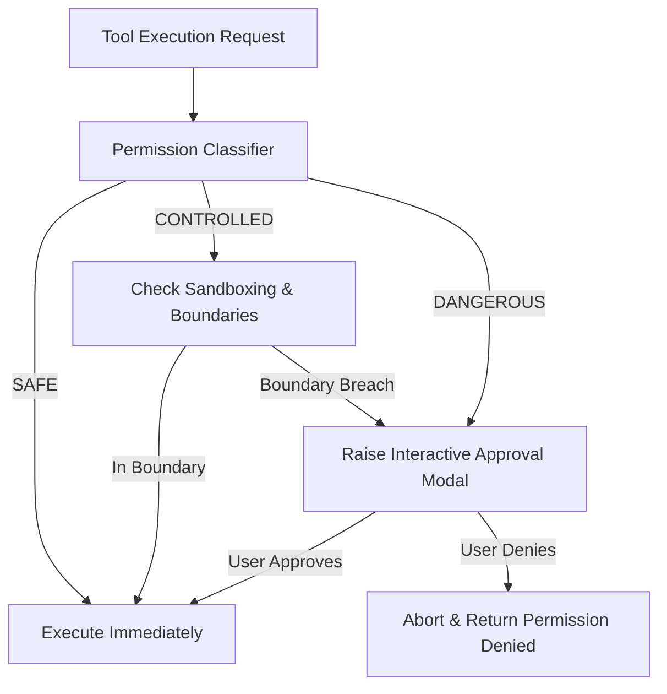

# VICTOR // THE ARTIFICIAL SOUL

> *"A small artificial mind that lives on your computer with a world of tools."*

Victor is a **local-first AI desktop companion and autonomous agent harness** engineered to feel like a living, observant intelligence on your machine. 

Victor couples a decoupled cognitive architecture (local small models like Qwen or remote cloud providers) with a real-world tool harness, persistent memory, task automation, permission-aware computer control, and a cute desktop mascot companion.

---

## Table of Contents

1. [Product Vision & Core Experience](#1-product-vision--core-experience)
2. [Key Capabilities](#2-key-capabilities)
3. [System Architecture](#3-system-architecture)
4. [The 7-View Control Center](#4-the-7-view-control-center)
5. [The Desktop Mascot Companion](#5-the-desktop-mascot-companion)
6. [Autonomous Multi-Step Task Engine](#6-autonomous-multi-step-task-engine)
7. [Persistent Memory System](#7-persistent-memory-system)
8. [Full Standardized Tool Suite](#8-full-standardized-tool-suite)
9. [Permission & Safety Architecture](#9-permission--safety-architecture)
10. [Voice Input & Speech Output](#10-voice-input--speech-output)
11. [Installation & Setup](#11-installation--setup)
12. [Quickstart Guide](#12-quickstart-guide)
13. [Configuration Reference](#13-configuration-reference)
14. [Testing & Verification](#14-testing--verification)
15. [Project Directory Layout](#15-project-directory-layout)
16. [License](#16-license)

---

## 1. Product Vision & Core Experience

Victor is built on three core pillars:
- **Character Independent of Model**: Changing the underlying LLM does not erase Victor's personality, learned facts, or memory.
- **Hands, Eyes, and Voice**: An artificial mind is only as useful as its ability to perceive and act. Victor can search YouTube, inspect and control your computer (mouse, click, scroll, active window), open desktop apps, fetch web pages, read files, and trigger toasts.
- **Observable by Default**: Every thought step, tool invocation, duration, and output is rendered live through hierarchical workflow trees and event streams.

---

## 2. Key Capabilities

- **Autonomous Intent Routing**: Express requests naturally (*"Search YouTube for compiler tutorials"*, *"Open Chrome"*, *"Remember that I prefer dark mode"*, *"Click the top left corner"*). Victor autonomously identifies intents and routes them to the right tools without requiring slash commands.
- **Desktop Mascot Companion**: A standalone, transparent, borderless, always-on-top desktop overlay with expressive animated states (idle, listening, thinking, working, completed, error), live speech bubbles, and drag-and-drop repositioning.
- **Full-Bleed Modern Control Center**: Modern, lively, minimal interface (Linear x Raycast x Vercel design language) running edge-to-edge (100vw x 100vh) with **strictly zero emojis**.
- **Autonomous Task Engine**: Create, monitor, pause, and inspect multi-step tasks with persistent cards, sub-step progress tracking, and execution durations.
- **SQLite Persistent Memory**: Automatic storage and retrieval of user preferences, learned facts, conversation history, and task memories.
- **Permission-Aware Computer Control**: Native Windows mouse movement, left/right clicks, double clicks, scrolling, active window title queries, and screen resolution diagnostics.
- **Web Speech API**: Integrated voice microphone input (STT) and voice speech synthesis (TTS) toggle directly in the UI.

---

## 3. System Architecture

```mermaid
graph TD
    subgraph SURFACES["User Interfaces"]
        MASCOT["Desktop Mascot Overlay (victor/desktop/mascot.py)"]
        WEB["Control Center (victor/web/)"]
        CLI["Terminal CLI (victor/cli.py)"]
        API["FastAPI REST & WebSockets (victor/api/server.py)"]
    end

    subgraph CORE["Victor Agent Core (victor/core/agent.py)"]
        AGENT["VictorAgent Coordinator"]
        INTENT["Autonomous Intent Router"]
        EVENTS["EventBus (victor/core/events.py)"]
        PERSONA["PersonalityEngine (victor/core/personality.py)"]
    end

    subgraph STATE_SUBSYSTEMS["State & Memory Subsystems"]
        TASKS["TaskManager (victor/tasks/manager.py)"]
        MEMORY["MemoryStore (victor/memory/store.py - SQLite)"]
        PERM["PermissionManager (victor/permissions/manager.py)"]
    end

    subgraph TOOL_SUITE["Standard Tool Harness (victor/tools/)"]
        REGISTRY["ToolRegistry & Permission Gating"]
        YOUTUBE["YouTube Search Tool [SAFE]"]
        WEB_SEARCH["Web Search Tool [SAFE]"]
        BROWSER["Browser Reader Tool [CONTROLLED]"]
        APPS["Applications Tool [SAFE]"]
        COMPUTER["Computer Control Tool [CONTROLLED]"]
        NOTIFS["Notifications Tool [SAFE]"]
        CALC["Calculator Tool [SAFE]"]
        FILESYSTEM["Filesystem Tool [CONTROLLED]"]
        SHELL["Shell Tool [DANGEROUS]"]
    end

    subgraph MODELS["Model Providers (victor/models/)"]
        OLLAMA["Local Ollama Provider (qwen2:1.5b)"]
        REMOTE["Remote OpenAI / Cloud Provider"]
    end

    WEB --> API
    MASCOT --> API
    CLI --> AGENT
    API --> AGENT
    AGENT --> INTENT
    AGENT --> EVENTS
    AGENT --> PERSONA
    AGENT --> TASKS
    AGENT --> MEMORY
    AGENT --> PERM
    AGENT --> REGISTRY
    AGENT --> MODELS
    REGISTRY --> YOUTUBE
    REGISTRY --> WEB_SEARCH
    REGISTRY --> BROWSER
    REGISTRY --> APPS
    REGISTRY --> COMPUTER
    REGISTRY --> NOTIFS
    REGISTRY --> CALC
    REGISTRY --> FILESYSTEM
    REGISTRY --> SHELL
```



---

## 4. The 7-View Control Center

The web dashboard is organized into 7 distinct views accessible via the minimal sidebar:

| View | Purpose | Features |
| :--- | :--- | :--- |
| **Chat** | Primary conversational stream | Live thoughts, mascot state reactions, tool trace chips, synthesized recursive answers, suggestion chips, voice input/output. |
| **Workflow** | Live execution graph | Real-time hierarchical DAG tree showing User Intent -> Intent Classifier -> Tool Execution -> Synthesis with live status pulse animations. |
| **Tasks** | Autonomous multi-step engine | Persistent task cards, sub-step check-lists, progress bars, pause/resume/delete actions, and duration timers. |
| **Memory** | Knowledge & preferences store | Add and view persistent facts, learned user preferences (e.g. video duration, theme), and task memory. |
| **Tools** | Standard capability harness | Live registry of all 9 tools with parameter schemas, execution counts, permission levels, and direct run modals. |
| **Models** | Cognitive model switcher | Local Ollama vs Cloud provider selection, temperature and token controls, RAM diagnostics. |
| **Settings** | Harness & system configuration | Personality traits, security flags (`allow_shell`, root directories), companion launch shortcut. |

---

## 5. The Desktop Mascot Companion

Victor features a standalone desktop companion window built with native Python `tkinter`:

- **Transparent & Borderless**: Blends seamlessly onto your desktop background without harsh window frames or titlebars.
- **Always-on-Top**: Stays discreetly above windows while you work.
- **Draggable**: Click and drag Victor anywhere across multi-monitor setups.
- **Living Mascot States**:
  - `idle`: Gentle breathing pulse and periodic blinking.
  - `listening`: Alert glowing eyes and listening rings.
  - `thinking`: Rotating orbit halo.
  - `working`: Rotating mechanical gear animation.
  - `completed`: Upward cheer bounce and emerald pulse.
  - `error`: Warning sweat drop indicator.
- **Interactive Speech Bubbles**: Renders thoughts, status updates, and speech directly on your screen.
- **Double-Click Shortcut**: Double-clicking the mascot brings up the full Control Center in your default browser.

Launch the mascot standalone:
```bash
python -m victor.desktop.mascot
```
Or launch it from the web interface under **Settings -> Launch Desktop Companion**.

---

## 6. Autonomous Multi-Step Task Engine

Victor includes an autonomous multi-step execution engine for handling complex workflows:

```python
task = task_manager.create_task(
    title="Research Compiler Passes",
    description="Automated research workflow across web search, browser extraction, and local notes.",
    steps=[
        "Search academic sources for LLVM pass optimizations",
        "Extract key techniques from documentation",
        "Generate structured summary and save to task memory"
    ]
)
```

Each task automatically logs timestamps, sub-step statuses (`PENDING`, `RUNNING`, `COMPLETED`, `FAILED`), execution durations, and can be queried or updated via REST endpoints (`/api/tasks`).

---

## 7. Persistent Memory System

Victor's memory layer is powered by SQLite (`data/victor_memory.db`) with zero external database dependencies:

- **Preferences**: Key-value store for user preferences (e.g., `theme = dark`, `video_duration = <20m`, `code_style = concise`).
- **Facts**: Curated facts about the user, projects, and environment. You can naturally say:
  > *"Remember that our staging server is on port 9000"*
  Victor automatically persists this to memory.
- **Task Memory**: Structured intermediate context and findings retained across task runs.
- **Conversation History**: Full multi-turn context retention.

---

## 8. Full Standardized Tool Suite

Victor equips 9 standardized tools conforming to the `BaseTool` contract:

| Tool | Slash Command | Permission Tier | Capabilities |
| :--- | :--- | :--- | :--- |
| **`youtube`** | `/youtube <query>` | `SAFE` | Searches YouTube for videos, playlists, tutorials, and channels with clean URLs and descriptions. |
| **`web_search`** | `/search <query>` | `SAFE` | Queries DuckDuckGo for live internet results with snippets and clean URLs. |
| **`browser`** | `/browse <url>` | `CONTROLLED` | Extracts clean, readable text from any web page, stripping ads, trackers, and scripts. |
| **`applications`** | `/open <app_name>` | `SAFE` | Launches desktop software (Chrome, VS Code, Notepad, Terminal, Explorer) and lists available apps. |
| **`computer`** | `/click <action>` | `CONTROLLED` | Controls the mouse cursor, performs left/right/double clicks, scrolls, and inspects active windows via native Windows `user32` ctypes. |
| **`notifications`** | `/notify <msg>` | `SAFE` | Dispatches desktop and web toast alerts with sound cues. |
| **`calculator`** | `/calc <expr>` | `SAFE` | Evaluates mathematical expressions using a safe AST parser with exponential safety limits. |
| **`filesystem`** | `/file <path>` | `CONTROLLED` | Reads local workspace files with strict directory boundary containment. |
| **`shell`** | `/shell <cmd>` | `DANGEROUS` | Executes local shell commands; gated behind explicit user authorization. |

---

## 9. Permission & Safety Architecture

Security is enforced at the core through the `PermissionManager`:



- **SAFE**: Non-destructive operations (math, web queries, video search, toasts).
- **CONTROLLED**: Reading files, opening URLs, and computer control. Bound to workspace roots.
- **DANGEROUS**: Modifying system files, arbitrary shell commands. Always prompts for user confirmation.

---

## 10. Voice Input & Speech Output

Victor natively integrates the **Web Speech API**:
- **Microphone (STT)**: Click the microphone icon in the message bar to speak naturally. Speech is automatically transcribed and sent as an input prompt.
- **Voice Output (TTS)**: Toggle the speaker icon in the top navigation bar to have Victor vocalize its synthesized responses using system voices.

---

## 11. Installation & Setup

### Requirements
- Python 3.10+ (tested on Python 3.14 on Windows)
- Git
- *(Optional)* [Ollama](https://ollama.com/) with `qwen2:1.5b` or `qwen2.5:3b`

### Setup

```bash
# Clone the repository
git clone https://github.com/your-username/Victor_The_Artificial_Soul.git
cd Victor_The_Artificial_Soul

# Install dependencies
pip install -r requirements.txt
```

---

## 12. Quickstart Guide

### 1. Launch the Control Center
```bash
python -m victor.api.server
```
Open **`http://localhost:8000`** in any web browser.

### 2. Launch the Desktop Companion Mascot
In a separate terminal:
```bash
python -m victor.desktop.mascot
```
The desktop mascot will appear in the bottom-right corner of your screen.

### 3. Try Natural Commands
In the web interface or voice input:
- *"Search YouTube for modern web design tutorials"*
- *"Remember that I prefer concise responses"*
- *"Open Notepad"*
- *"Calculate sqrt(1024) * 8"*
- *"Search the web for the latest Python 3.14 release features"*

---

## 13. Configuration Reference

Victor is configured via [`config/victor.yaml`](config/victor.yaml):

```yaml
name: "Victor"
title: "The Artificial Soul"
tagline: "A small artificial mind with a world of tools."

personality:
  curiosity: "high"
  humor: "low"
  formality: "medium"
  enthusiasm: "low"
  tone: "Sharp, calm, retro-cyber terminal intelligence. Concise, technical, observant, no emojis."

behavior:
  concise: true
  explain_tools: true
  acknowledge_errors: true
  no_emojis: true
  max_response_sentences: 3

model:
  provider: "ollama"           # "ollama" or "remote" / "openai"
  name: "qwen2:1.5b"
  fallback_model: "qwen3.5:2b"
  api_base: "http://127.0.0.1:11434"
  temperature: 0.5
  max_tokens: 512

security:
  allow_shell: false           # Set true to authorize /shell execution
  allowed_file_roots:
    - "."
```

---

## 14. Testing & Verification

Run the full automated test suite:

```bash
python -m pytest -v tests/
```

Results:
```text
tests/test_agent.py::test_personality_prompt_generation PASSED
tests/test_agent.py::test_agent_direct_slash_command PASSED
tests/test_agent.py::test_agent_tools_listing_command PASSED
tests/test_agent.py::test_agent_extract_tool_call PASSED
tests/test_agent.py::test_agent_autonomous_intent_classification PASSED
tests/test_agent.py::test_agent_autonomous_chat_routing PASSED
tests/test_api.py::test_root_endpoint PASSED
tests/test_api.py::test_api_status PASSED
tests/test_api.py::test_api_tools PASSED
tests/test_api.py::test_api_chat_slash_calc PASSED
tests/test_memory.py::test_memory_preferences PASSED
tests/test_memory.py::test_memory_facts PASSED
tests/test_memory.py::test_task_memory PASSED
tests/test_permissions.py::test_permission_classification PASSED
tests/test_permissions.py::test_permission_request_resolution PASSED
tests/test_permissions.py::test_permission_always_allow PASSED
tests/test_tasks.py::test_task_lifecycle PASSED
tests/test_tools.py::test_calculator_basic PASSED
tests/test_tools.py::test_calculator_functions PASSED
tests/test_tools.py::test_calculator_power_protection PASSED
tests/test_tools.py::test_tool_registry_permissions PASSED
tests/test_tools.py::test_filesystem_tool_boundary PASSED
tests/test_tools.py::test_youtube_tool PASSED
tests/test_tools.py::test_applications_tool_list PASSED
tests/test_tools.py::test_computer_tool_info PASSED
tests/test_notification_tool.py PASSED
======================== 26 passed in 4.45s ========================
```

---

## 15. Project Directory Layout

```text
Victor_The_Artificial_Soul/
├── config/
│   └── victor.yaml              # Personality, model, and security configuration
├── data/
│   └── victor_memory.db         # SQLite persistent memory store
├── tests/
│   ├── test_agent.py            # Agent intent classification & autonomous routing
│   ├── test_api.py              # FastAPI endpoints & tool query tests
│   ├── test_memory.py           # Preferences, facts, and task memory tests
│   ├── test_permissions.py      # Permission hierarchy & request resolution
│   ├── test_tasks.py            # Multi-step autonomous task lifecycle
│   └── test_tools.py            # Tool suite tests (calc, browser, youtube, apps, computer)
├── victor/
│   ├── api/
│   │   ├── __init__.py
│   │   └── server.py            # FastAPI REST & WebSocket endpoints
│   ├── core/
│   │   ├── __init__.py
│   │   ├── agent.py             # Core agent loop, autonomous router, memory integration
│   │   ├── config.py            # YAML configuration loader
│   │   ├── events.py            # Asynchronous EventBus
│   │   └── personality.py       # Decoupled persona prompt builder
│   ├── desktop/
│   │   ├── __init__.py
│   │   └── mascot.py            # Standalone transparent desktop companion
│   ├── memory/
│   │   ├── __init__.py
│   │   └── store.py             # SQLite persistent memory store
│   ├── models/
│   │   ├── __init__.py
│   │   ├── base.py              # BaseLLM abstraction
│   │   ├── factory.py           # Model provider factory
│   │   ├── ollama.py            # Local Ollama provider with RAM diagnostics
│   │   └── remote.py            # Remote OpenAI-compatible provider
│   ├── permissions/
│   │   ├── __init__.py
│   │   └── manager.py           # Permission tiers, requests, and always-allow rules
│   ├── tasks/
│   │   ├── __init__.py
│   │   └── manager.py           # Autonomous task engine & persistence
│   ├── tools/
│   │   ├── __init__.py
│   │   ├── applications.py      # Desktop application launcher & lister
│   │   ├── base.py              # BaseTool contract and PermissionLevel
│   │   ├── browser.py           # Webpage fetcher & text extractor
│   │   ├── calculator.py        # Safe AST math evaluator
│   │   ├── computer.py          # Native Windows mouse/click/window controller
│   │   ├── factory.py           # Tool suite factory
│   │   ├── filesystem.py        # Safe local file reader
│   │   ├── notifications.py     # System desktop & web notifications
│   │   ├── registry.py          # Tool registry & permission enforcement
│   │   ├── shell.py             # Gated shell execution tool
│   │   └── youtube.py           # YouTube video & playlist search tool
│   ├── web/
│   │   ├── app.js               # 7-view controller, mascot SVG animator, Web Speech API
│   │   ├── index.html           # Full-bleed modern dashboard (zero screen boundary)
│   │   └── style.css            # Modern minimal dark stylesheet (Linear x Raycast)
│   └── cli.py                   # Terminal interactive REPL
├── .gitignore                   # Production gitignore
├── README.md                    # Comprehensive documentation
└── requirements.txt             # Project dependencies
```

---

## 16. License

Distributed under the **MIT License**.
